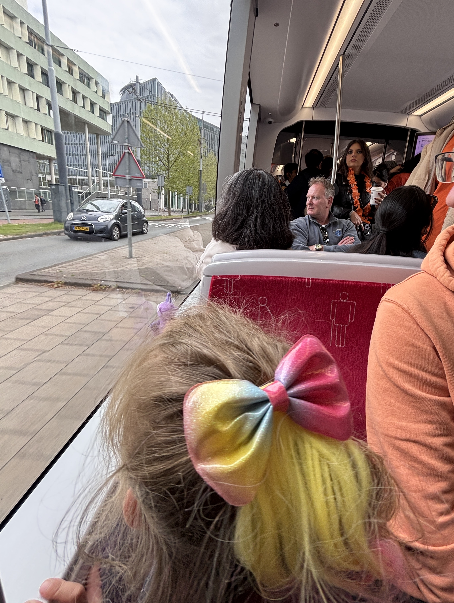

День Короля прошел отлично: теплая летняя погода дала всем насладиться гуляниями на улице. Особенно песикам.

  <video controls>
    <source src="./i/herman-de-hond.mp4" type="video/mp4">
    Ваш браузер не поддерживает видео.
  </video>

Утром мы прошлись по рынку. Накупили себе много всего. Особенно рад был ребенок: по €1 игрушки.

  <video controls>
    <source src="./i/koningsdag-market.mp4" type="video/mp4">
    Ваш браузер не поддерживает видео.
  </video>

После обеда мы поехали на трамвае в Амстердам. Весь транспорт был переполнен. Потом я уже сильно позже узнала, что было объявление не ездить в центр. Все площади и каналы были переполнены людьми.

<figure class="article-img __top"></figure>

Тогровля кипела еще на улицах Амстердама.

  <video controls>
    <source src="./i/koningsdag-tram.mp4" type="video/mp4">
    Ваш браузер не поддерживает видео.
  </video>

В сасмом большом парке города царил праздничный вайб.

  <video controls>
    <source src="./i/koningsdag-vondel-park.mp4" type="video/mp4">
    Ваш браузер не поддерживает видео.
  </video>

В целом, все прошло тихо. Было несколько арестов за драки и много мусора на улицах после кутежа. Но на утро все выглядело так словно ничего и не было.
