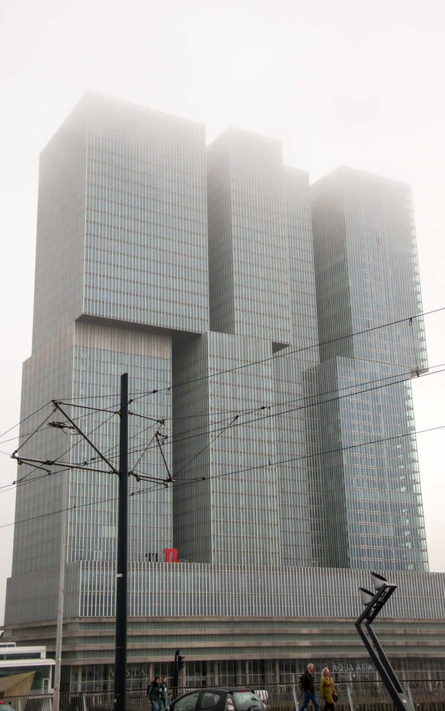
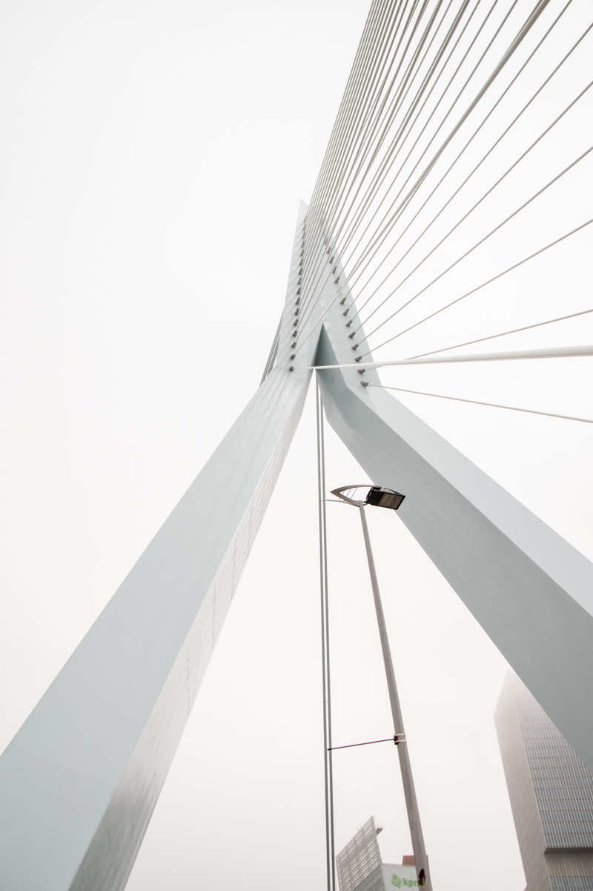
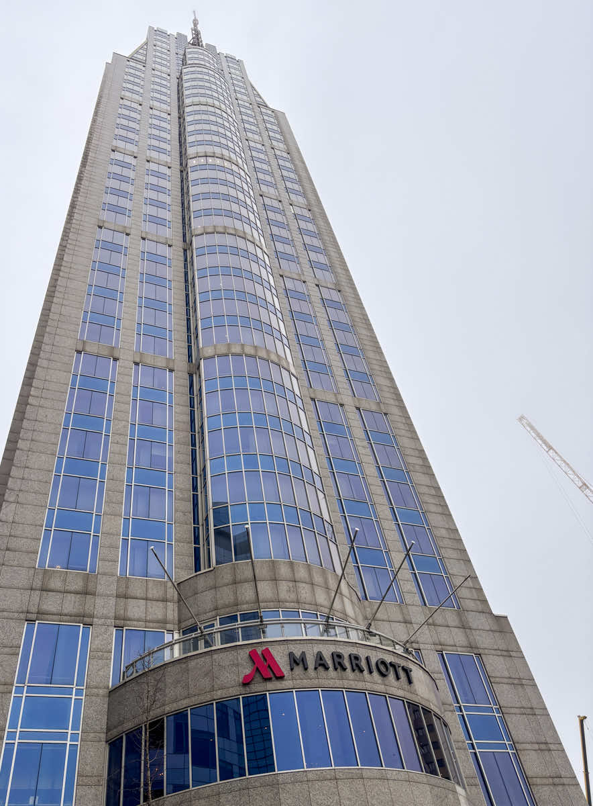

Покажу в начале картинки, которые могут ввести в заблуждение: а Нидерланды ли это.

<figure class="article-figure"></figure>

Белый вантавый мост Erasmusbrug.

<figure class="article-figure"></figure>

## Немного из истории города

Я знаю, что ты уже догадался - это Роттердам. Абсолютно не похожий на другие города. Если кто-то читающий эту заметку готовился к экзамену KNM, знает почему так произошло. Я сейчас немного расскажу про некоторые грустные события и прошу немного подробнее рассмотреть картинку ниже.

<figure class="article-figure"></figure>

14 мая 1940 года центр города был полностью уничтожен. Немецкая авиация сбросила около 97 тонн бомб. В последствии было решено не восстанавливать исторический центр. Сейчас мы видим исключительно современную постройку.

<figure class="article-figure"></figure>

Проходя вантавый мост я увидела типичную нидерландскую застройку, но центр вдалеке абсолютно новый. Вот такой вот контраст.

## Кубические дома

<figure class="article-figure"></figure>

Kijk-Kubus Museum-house — знаменитые кубические дома. Перейдя по этому <a href="https://www.kubuswoning.nl/en/archive.html" target="_blank" rel="nofollow noopener noreferrer">линку</a>, можно посмотреть историю их создания.

<figure class="article-figure"></figure>

Эти дома продаются. У музея всего один домик. Вход платный, но не очень дорого. Я не стала заходить, ибо меня начинает штормить от наклонных стен. Пол в этих домах обычный, но все стены с окнами под наклоном. На любителя, однако. Стоит такой домик на момент написания заметки €450.000, жилая площадь - 99 m². Достаточно хорошая цена.

<figure class="article-figure"></figure>

Погода сегодня не позволила запечатлеть домики на фоне синего неба. Но ничего: мы еще вернемся сюда. У меня, конечно, было вначале небольшое разочарование: по фотографиям из интернета кубики мне казались побольше.

## Центр города

<figure class="article-figure"></figure>

Центр города произвел на нас вау эффект. Мы еще хотим сюла вернуться с уже готовой программой обхода всех интересных мест. Сегодня мы ездили на несколько часов, чтобы немного познакомиться с городом. Я прям очень рекомендую Роттердам для посещения. А кто любит Нью-Йоркский стиль, то может и переселения сюда: тут прям ощущение города-города.

<figure class="article-figure"></figure>

<figure class="article-figure"></figure>
