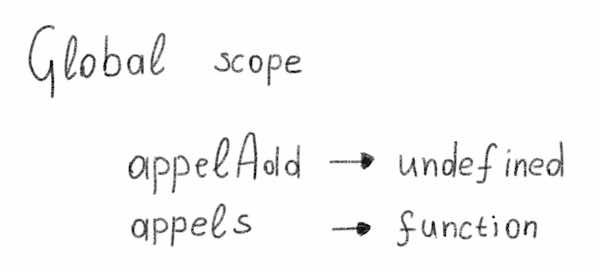
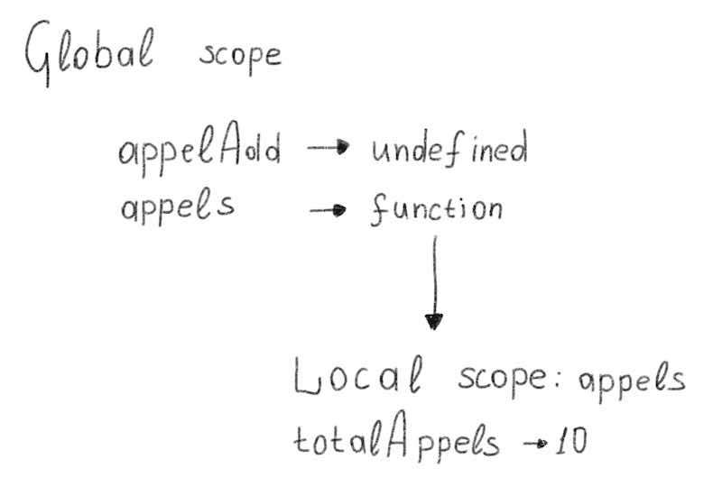
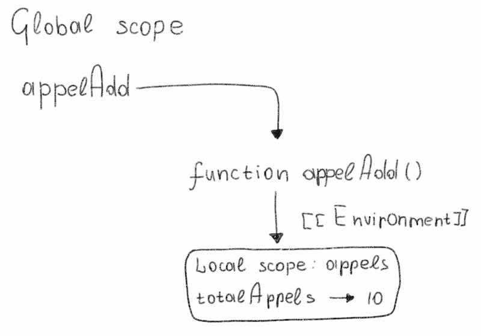
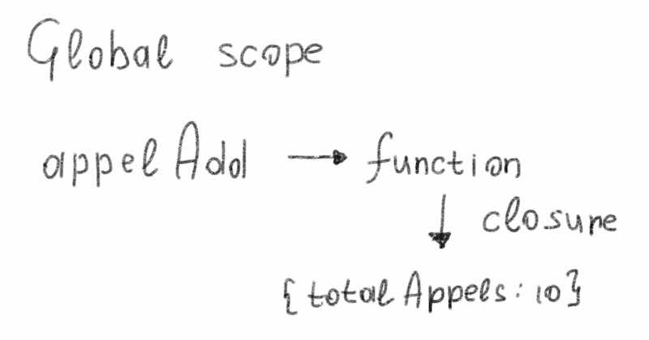
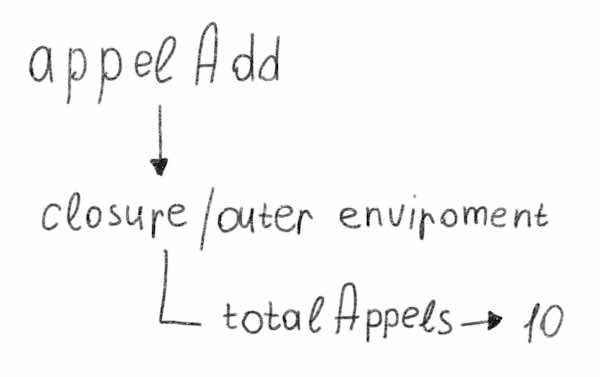

Simple example:

```js
const addOne = function () {
  let num = 10;

  return function () {
    return console.log(num++);
  };
};

const exp = addOne();
exp(); // 10
exp(); // 11
exp(); // 12

const expAdd = addOne();
expAdd(); //?
expAdd(); //?
expAdd(); //?
```

Try to solve this example on your own:

```js
let appelAdd;

const appels = function () {
  const totalAppels = 10;

  appelAdd = function () {
    console.log(totalAppels + 1);
  };
};

appels();
appelAdd(); //?
```

1. First, the global lexical environment is created:

<div class="article-content__left">
  
</div>

2. Then, `appels()` is called.

<div class="article-content__left">
  
</div>

3. Inside `appels`, a new function is created and assigned to `appelAdd`:

```js
appelAdd = function () {
  console.log(totalAppels + 1);
};
```

<div class="article-content__left">
  
</div>

4. `appels()` → finished. But its lexical environment is still accessible:

<div class="article-content__left">
  
</div>

5. Then, `appelAdd()` is called. JavaScript executes the function.

<div class="article-content__left">
  
</div>

<div class="article-at __green">Main rule: a function remembers where it was created. The [[Environment]] reference is set once and for all when the function is created.</div>
