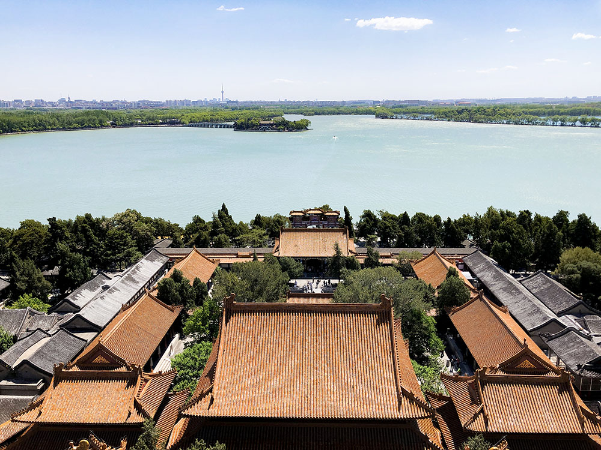
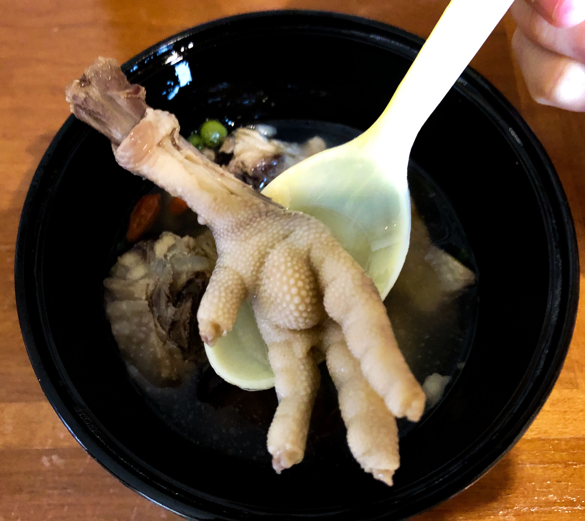

> "Если ты не побывал на Великой Китайской стене, ты ненастоящий китаец" 
> Мао Цзэдун

И побывать на стене действительно стоит. Есть несколько способов туда попасть. Мы выбрали самостаятельный и экономный - на электирчке через Бадалин. Ниже я опишу редкие вещи, которые нечасто встретишь в статьях из интернета.

<b>Города:</b> Пекин, Далянь

<b>Время:</b> конец апреля 2019

## Сборы

Когда отправляешься в страну, где совсем не говорят по-английски, то нужно быть очень аккуратным при выборе необходимых вещей. Я не по наслышке знаю, что в Китае все очень плохо с иностранными языками. Поэтому нужно подготовиться ко всяким непредвиденным обстоятельствам (конечно, никто не утверждает, что можно покрыть 100% неприятностей).
Во многих обзорах пишут, что мол распечатайте адрес отеля или мест, которые будешь посещать. Не нужно. На карте (google например) все есть в двух языковых версиях. Листики с адресами на А4 ушли в прошлое. Единственное, что нужно держать при себе - ваучеры отелей. Все остальное нагуглишь без труда.

Взять с собой необходимый набор лекарств. Особенно рекомендую от кишечных расстройств/отравлений: вода питьевая другая, еда - тем более. Антибиотики я бы брать не стала: с ними шутки плохи, да и провозить непонятно как. Если не хочешь проблем с таможней, то лучше иметь назначение врача с названиями лекарств на латинице и со всеми подписями/печатями. В самолет можно пронести лекарства, которые необходимо принять в пути. На самом деле, на таможне не спрашивают про медикаменты. Но лучше не рисковать и брать только необходимое, опять же с выпиской от доктора. Помни, Китай очень консервативная и строгая страна.

## Перелет

Мы летели через Москву. От Москвы до Пекина 7 с небольшим часов. Разница во времени 5 часов. В самолете достаточно сухой воздух. Поэтому, если есть проблемы с органами дыхания, лучше взять что-то увлажняющее (небольшие спреи, масла). Над Монголией будет болтанка: там турбулентность дикая. В обе стороны пришлось потерпеть.

Конечно, по прилету накрывает jet lag. Но у нас был самолет в ночь и мы прилетели в 6 утра. Пересилить себя тяжело и не уснуть, придя в отель. И пару часов все же поспали. Но на следующий день были в норме.

## Отели

Так как по середине наших приключений был запланирован город Далянь, то и отели нам пришлось выбрать разные. Решили воспользоваться услугами сайта Agoda. И если с первым отелем нам повезло, как и с отелем в Далянь, то с третьим был кошмар.

И так, первый отель был 2 звезды. Он полностью соответствовал описанию на ресурсе. Все прошло достаточно хорошо: скромная комната со скромным инвентарем, но достаточно чисто. Второй отель был в Далянь, и он превзошел все ожидания: 28-ой этаж, шикарный вид и абсолютно европейский номер. Разница в цене была небольшой между первым и вторым отелем. В Далянь мы провели шикарные три ночи.

Когда вернулись обратно в Пекин, нас ждал третий отель. И он на ресурсе был представлен как четырехзвездочный. Но при этом скидки на номера были 75%. Это конечно насторожило, но мы решили рискнуть. И получили очень плохой опыт: отель на деле не соответствовал даже и двум звездам. Да, такими уловками пользуются некоторые недобросовестные отели. К сожалению, мы поздно узнали. Бронируй номера в проверенных или сетевых отелях. Проверить можно на ресурсах с отзывами.

## Пекин

Очень большой город: в Wiki можно посмотреть его площадь. Я ощутила это передвигаясь на метро. Что же касательно самого метро: оно модное, современное. Большое количество линий и станций, но все названия переведены на английский. Мы много перемещались и поэтому приобрели проездной (ну как у нас в Москве или Питере).

Называется проездной "Икатун (Yikatong). Стоит он 20 юань: надо положить сверху еще денег на проезд. Купить можно в кассе метрополитена. В интернете много гайдов по пекинскому метро. Если ты уже живешь в большом городе, где есть подземка, то дискомфорта не испытаешь: все понятно, просто и легко. Мы спокойно передвигались между пунктами назначения. Иногда наша поездка составляла 50 минут. В самих вагонах есть вожатые (это я их так называю). На перроне иногда тоже присутствуют специальные люди, чтобы в громкоговоритель регулировать поток.

Какой минус я увидела в метро: тебя не выпускают из вагона. Да, да, не стоит удивляться. Люди, при открывании дверей, сразу начинают заходить. Посередине есть полоска на полу, что выходить надо через середину дверей, но это не работает. И ты пытаешься вытолкнуться из вагона любыми путями. Вот это огромный минус. У пекинцев (я не буду тут говорить про всю страну, так как сейчас речь о севере) вообще отсутствует чувство такта: менталитет другой, да и много их. Кто первый - тот и молодец. Будь готов к борьбе, даже если ты гайдзин (яп.)

Первое место, куда мы направились, это был парк Бэйхай. Красивое место. Не буду о нем писать подробно: все можно тоже найти в инете. Скажу, что очень прекрасное место, которое стоит посетить обязательно. В округе есть еще парки. Вход во все парки в основном 20 юань. По времени потратить на этот парк и на все, что есть поблизости, можно смело день. При чем это так, если идти с раннего утра. Если идешь с обеда, то нужно заложить два дня. Все парки, строения и т.п. в Китае очень большие. Забежать и осмотреть за час-два - нет, у тебя не выйдет. Богатая история, большие площади с садами, пагодами.

Погода в Пекине для нас была тяжелой: жара в сочетании с дикой влажностью. Мне было тяжело дышать. Еще в апреле много ветряных бурь и над городом висит смог: это скорее скопление частиц в воздухе с гор и растений. Да, еще плюс выхлопы от транспорта: а транспорта, как и людей, в столице очень много. Как я потом прочитала, много людей умирает от легочных болезней. И если раньше я была не против год-два пожить в Пекине, то теперь понимаю, что это невозможно. Одежда после стирки сохнет очень долго (два-три дня). Отели были все слегка облезлым и пахли затхлостью.

На самом деле, все что я описываю, может работать по-другому на другом человеке. Кому-то и поведение в метро покажется обычным и климат по душе. Все, что ты читаешь, я описываю со своей колокольни и прошу строго не судить. Ну, вернемся...

## Достопримечательности Пекина

Я хочу затронуть не конкретные места и написать много текста обо всем, а немного рассказать о том как попасть туда и что ждет тебя. Потому что, допустим, чтобы попасть в Рейхстаг в Берлине, нужно заранее(за пару недель) зарегистрироваться на официальном сайте.

Конечно самым интересным и популярным местом является площадь Тяньаньмэнь. Туристов всегда туда везут чуть ли не в первый день. Добраться до нее самостоятельно можно на метро. Но так как мы жили не очень далеко, то дошли пешком. Чтобы попасть на нее, нужно пройти контроль: это обычные посты, где личные вещи проходят контроль. Также тебя осмотрят металлоискателем. Не нужно этого пугаться: в Пекине чуть ли не на каждом шагу будут проверять. Причин там несколько и их можно тоже узнать из рунета. Я о них говорить не буду, так как официально я не проверяла насколько они достоверны. Еще у нас проверили наши заграничные паспорта с визами. Казалось бы, хочется оставить паспорт в отеле в сейфе. А нет! Носи паспорт с собой: это вам не Тайланд.

Туристов очень много, а местных еще больше: это же страна с самым большим населением. Готовься к толкотне и примите это. Расстраиваться не нужно, потому что есть места, где можно выдохнуть. Да, да - это номер твоего отеля. Крепись, терпи и вечером тебе воздастся. Пишу как есть. Попасть в ресторан с хорошим рейтингом действительно тяжело.

Все самое большое и культурное находится в центре. Есть места и на севере города. Одним из самых потрясающих для меня стало место "Летний императорский дворец" или парк Ихэюань. Рекомендую к посещению. Там замечательные виды, богатая история и просто невероятные сооружения. В целом, Пекин - это про историю.

Я не обладаю даром красиво описывать места текстом, но ты можешь поверить мне наслово, что там потрясающе. Для посещения этого места очень рекомендую нанять гида. Мы прочитали все на табличках и в интернете, но гид расскажет больше и проведет по самым важным местам. Мы обошли где-то 80% территории. И я бы вернулась еще раз, чтобы пройти оставшиеся 20%.

Про сами билетам: они бывают комплексные и обычные. Комплексные подороже обычных: в них входят дополнительные посещения пагод, святилищ и т.п. Да, да, если ты попал в парк, это не означает, что все доступно. Иногда придется покупать дополнительные билеты на вход. И при чем, это обычная практика.

## Скоростные поезда

В этой поездке решено было опробовать 350 км/ч. В Китае такие поезда имеют в своем названии букву G. Мы решили поехать в северный город Далянь. Билеты можно купить двумя путями: на месте перед поездом и онлайн. Так как мы заранее бронировали отель и, чтобы не было неприятностей, купили через обычный онлайн-сервис. Сверху была небольшая комиссия, зато так спокойнее.

Перед посадкой билеты обязательно надо распечатать в кассе на вокзале. Для этого есть специальное окно: там висит объявление... на китайском (английских табличек нет!). Но ты справишься. Я покажу внешний вид билета и попрошу найти на нем вагон и место.

Но, воспользовавшись переводчиком, мы выяснили куда нам. Без проблем сели на свои места и продолжили путешествие. На самом деле, поезда не развивают скорость до 350 км/ч: максимальная скорость 320 км/ч. Но это больше, чем у Сапсана между Питером и Москвой.

А вот и еще одна причина, по которой было решено опробовать поезд: вид из окна. И я скажу тебе, что это дико необычно. Самое шокирующее, лично для меня, стали могилки в огородах. У китайцев действительно раньше не было кладбищ. Они хранили по феншую рядом с домом: на возвышенностях, если человек был в каком-то статусе. И сейчас за городом эти традиции еще живут. Тут, опять повторюсь, другой менталитет и другая культура.

Еще один шок: когда мы ехали и в окно было видно много полей с саженцами, а посреди стоял бетонный многоэтажный дом. Я не понимаю, как такое возможно. Но оно возможно.

В общем, можно увидеть много всего шокирующего и забавного. И, видимо, тоже лучше нанять гида, который все объяснит. Можно просто подготовить себя, почитав в интернете информацию перед поездкой. Но да, нужно быть подготовленным к необычным вещам. В каждой стране есть свои правила и нормы поведения, и нужно их соблюдать.

## Еда

Есть можно все. Звучит странно, да? Но я очень избирательный человек, да еще в добавок имею проблемы с пищеварением. Но, чтобы я не ела в путешествии, все было вкусно, а главное без последствий. Так как север страны это традиционный край, то найти европейскую кухню достаточно проблематично. Мы так и не нашли. Питались исключительно традиционными блюдами.
Самым экзотическим для нас оказался хого, или китайский самовар (火锅 huǒguō, хот-пот).

А для меня, когда я заболела, принесли супчик с вот таким сюрпризом.

Я его спокойно съела. Это оказалось очень питательно и вкусно. Поэтому экспериментируй, кушай все, что только можно.

Кстати, фрукты мы покупали в местных продуктовых магазинах. Они были хорошего качества и очень вкусные. Фрукты на ужин самое то.

## Вывод

Север страны рекомендован к посещению. Но я бы не ехала надолго: одной недели будет достаточно. Рассмотреть все все равно не получится. Нужно выбирать места из путеводителя точечно и ориентироваться на свои вкусы/желания. По возможности нанимать гида: если не очень хочется читать много текста в интернете. Читать обязательно статьи с правилами поведения: еще раз повторю, что Китай очень строгая страна. По достопримечательностям много гайдов в интернете. Бронировать отели, покупать билеты - есть специальные сервисы. Это все легко сделать. И, конечно, неплохо бы знать английский.

Описать всю поездку у меня не получится: очень много всего. Мы планировали все сами, без посторонней помощи. Поэтому путешествие вышло очень насыщенным.

Bon voyage !
