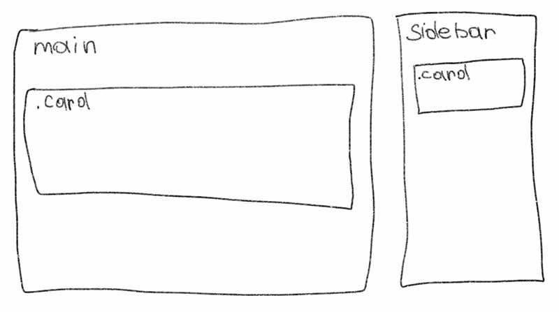
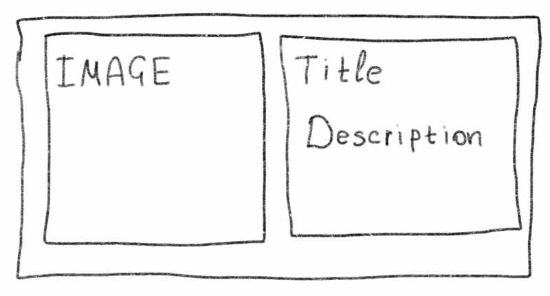
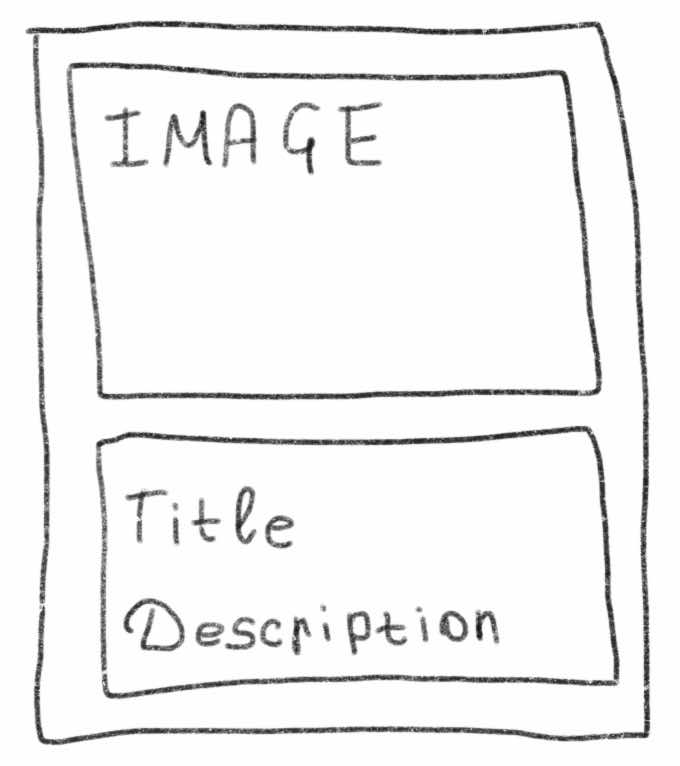

I didn't take the survey this year. I had no time, sorry. But I would like to explore the results. I usually find some interesting things there. A couple of days ago, I started using `:has`. Let's explore!

## `:has()`

```css
.article a:not(:has(img)) {
  color: var(--article-link-color);
  text-decoration: none;
  border-bottom: 2px solid var(--article-link-border-color);

  &:hover {
    color: var(--article-link-color-hover);
  }
}
```

The functional pseudo-class `:has()` is brilliant for me. It is so useful. Can you imagine another way to handle my case with non-standard links in my blog? The code above is simple. Sometimes I put an `img` inside an `a`. `:has()` can handle it without any problems.

You can find more information on <a href="https://developer.mozilla.org/en-US/docs/Web/CSS/Reference/Selectors/:has" target="_blank" rel="noopener noreferrer">MDN</a>. The article probably contains some difficult examples. CSS is becoming more and more confusing. All modern browsers support `:has()`.

## CSS Nesting

I've been using CSS nesting since 2023. It's convenient: no additional libraries, no preprocessors, no extra compilation. I try to keep the structure simple and avoid deep nesting.

```css
.button {
    background-color: var(--button-bg);


  &:hover:not(:disabled) {
    background-color: var(--button-bg-hover);
  }

  &.active {
    background-color: var(--button-bg-active);
  }
```

Deep nesting can be difficult to understand. But simple nesting, like in the example above, is clear. By the way, it might not be enough for complex projects. But for smaller projects, it works really well.

Nesting reduces selector repetition and file size. More information is available on <a href="https://drafts.csswg.org/css-nesting-1/" target="_blank" rel="noopener noreferrer">CSSWG</a> website.

## Subgrid

I spent some time trying to understand how it works. But `subgrid` is a really great feature. `Subgrid is` a CSS Grid feature that allows a nested grid to use its parent's grid. Let me show you how it works.

```html
<div class="cards">
  <div class="card">
    <h3>Lorem ipsum</h3>
    <p>
      Lorem ipsum dolor sit amet, consectetur adipiscing elit, sed do eiusmod
      tempor incididunt ut labore et dolore magna aliqua
    </p>
    <button>More</button>
  </div>

  <div class="card">
    <h3>Lorem ipsum dolor sit amet, consectetur adipiscing</h3>
    <p>Lorem ipsum dolor sit amet, consectetur adipiscing elit</p>
    <button>More</button>
  </div>
</div>
```

If you want to keep all the titles aligned on the same line, you can do it differently with `subgrid`.

```css
.cards {
  display: grid;
  grid-template-columns: repeat(3, 1fr);
}

.card {
  display: grid;
  grid-row: span 3;

  grid-template-rows: subgrid;
}
```

<style type="text/css">
.cards {
  display: grid;
  grid-template-columns: repeat(2, 1fr);
  gap: 20px;
}

.card:nth-child(even) {
  border-inline-start: 2px dashed #ccc;
  padding-inline-start: 20px;
}

.card {
  display: grid;
  grid-row: span 3;

  grid-template-rows: subgrid;
}
</style>

<div class="demo-box">
  <h3 class="demo-box__title">Result</h3>
  <div class="demo-box__body">
    <div class="cards">
      <div class="card">
        <h4>Lorem ipsum</h4>
        <p>Lorem ipsum dolor sit amet, consectetur adipiscing elit, sed do eiusmod tempor incididunt ut labore et dolore magna aliqua</p>
        <button>More</button>
      </div>
      <article class="card">
        <h4>Lorem ipsum dolor sit amet, consectetur adipiscing</h4>
        <p>Lorem ipsum dolor sit amet, consectetur adipiscing elit</p>
        <button>More</button>
      </article>
    </div>
  </div>
</div>

This is a simple example to get the idea. More information <a href="https://web-platform-dx.github.io/web-features-explorer/features/subgrid/" target="_blank" rel="noopener noreferrer">here</a>.

## `@supports`

CSS is changing all the time. There are a lot of new features, and we don't always know how they work in different browsers. `@supports` exists to help with this. It allows us to tell the browser: "If you understand this property, apply these styles."

For example, `grid`:

```css
.cards {
  display: block;
}

@supports (grid-template-rows: subgrid) {
  .cards {
    display: grid;
  }

  .card {
    grid-template-rows: subgrid;
  }
}
```

If the browser doesn't support subgrid, it won't apply the styles inside this block.

It's also possible to add a fallback.

```css
@supports not (grid-template-columns: subgrid) {
  .card {
    /* fallback */
  }
}
```

But maybe progressive enhancement is a better approach. More information on <a href="https://developer.mozilla.org/en-US/docs/Web/CSS/Reference/At-rules/@supports" target="_blank" rel="noopener noreferrer">MDN</a>

## CSS container queries

The main idea is that a container query looks at the size of the component's container. It's another way in CSS to change or adapt the size of elements on a web page.

<div class="article-content__center"></div>

For example, there are two identical cards in different places on the web page. One of them is in `main` content, and the other is in `sidebar`. When a user changes the page size or opens it on a different device, the card can have a one- or two-column layout. If you use `@media` to define the card's layout, the viewport can be wide, but the `sidebar` may stay narrow. In this case, the card may not be displayed correctly.

If the container is wide:

<div class="article-content__center"></div>

If the container is narrow:

<div class="article-content__center"></div>

In this case, using a container query is a good solution. The width of the card will depend on the width of its parent container.

```css
@container (width >= 500px) {
  .card {
    display: grid;
    grid-template-columns: 200px 1fr;
  }
}
```

In this example, the styles are based on the nearest ancestor that establishes a query container.

```css
.sidebar {
  container: sidebar / inline-size;
}

.card-container {
  container: card / inline-size;
}
```

A query container can also have a name. You can set it using the container-name and container-type properties, or with the container shorthand.

```css
@container card (width >= 400px) {
  .card {
    /* depends on .card-container */
  }
}
```

I like new features. Some of them are difficult, while others are very helpful. This article explores several CSS features. Not all of them work in every browser, so it's worth checking browser support on <a href="https://caniuse.com" target="_blank" rel="noopener noreferrer">Can I Use</a>.

Some of these features deserve separate articles and a deeper exploration to better understand how they work.
