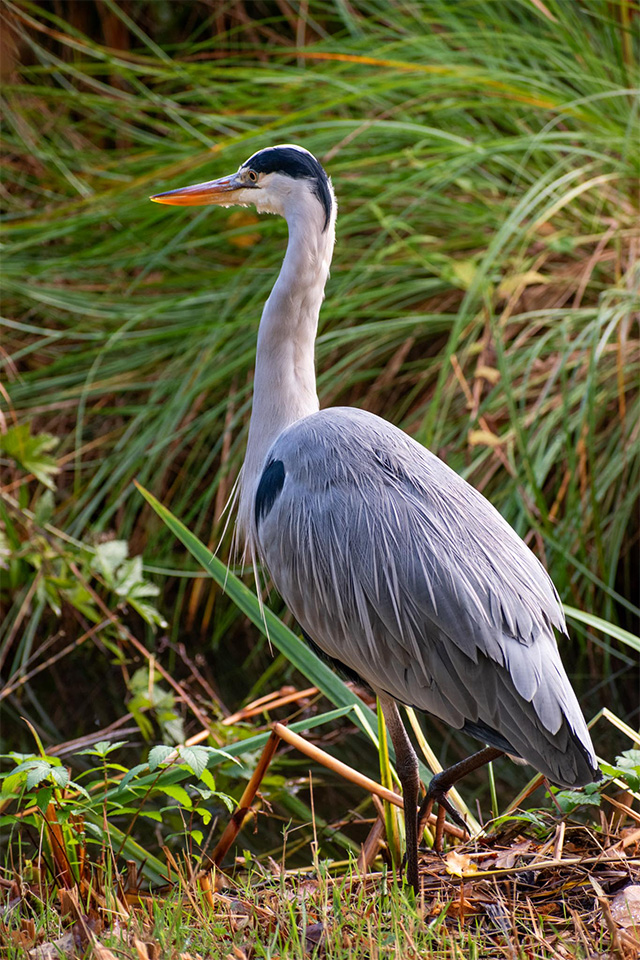

И так. Ух! Как же я отстала, что не заметила новинки (или забытое старое), которые все активно используют. Ну, а кто как и я был долго в глубокой заморозеке, добро пожаловать.

## Writing modes: vertical-text и text-orientation

```css
.container-text {
  writing-mode: vertical-lr;
  text-orientation: upright;
}
```

На MDN можно посмотреть все значения <span class="article-at __yellow">writing-mode</span>. По этой [ссылке](https://developer.mozilla.org/en-US/docs/Web/CSS/text-orientation) описание и примеры. Суть этого свойства в расположении текста: вертикально или горизонтально.

<span class="article-bold">Пример</span><br/><br/>

<style type="text/css">
  .container-text {
     writing-mode: vertical-lr;
     text-orientation: upright;
  }
</style>

<div class="container-text">
Lorem ipsum<br/>dolor sit amet<br/>consectetur<br/>adipiscing elit
</div>

Свойство <span class="article-at __yellow">text-orientation</span> работает при отображении текста вертикально.

## Свойство content-visibility

```css
content-visibility: [value];
```

[Ссылка](https://drafts.csswg.org/css-contain/#content-visibility) на саму спеку. Чем интересно данное свойство: с помощью него можно скрыть содержимое элемента, которое не будет участвоваь в рендеринге. Пока не вижу, что это кто-то сильно поддерживает. Разве что Chrome.

## Свойство accent-color

Свойство для установки цвета элементам контроля.

```css
.checkbox {
  accent-color: #f79a5b;
}
```

<style type="text/css" >
  .checkbox-accent-color {
    width: 20px;
    height: 20px;
    accent-color: #f79a5b;
  }
</style>

<input type="checkbox" class="checkbox-accent-color" id="example-accent-color" />
<label for="example-accent-color">Example accent-color</label>

Пример для группы

<style type="text/css">
  .radio-accent-color {
    display: inline-block;
    vertical-align: bottom;
    width: 20px;
    height: 20px;
  }

  .radio-accent-color.green {
    accent-color: #74992e;
  }

  .radio-accent-color.yellow {
    accent-color: #ffff80;
  }

</style>

<div class="radio">
<input type="radio" class="radio-accent-color green" name="radio-accent-color" id="example-accent-color-radio1" />
<label for="example-accent-color-radio1">Example for green radio</label>
</div>

<div class="radio">
<input type="radio" class="radio-accent-color yellow" name="radio-accent-color" id="example-accent-color-radio2" />
<label for="example-accent-color-radio2">Example for yellow radio</label>
</div>

Поддерживают все браузеры.

## Shapes & Graphics

Хорошо, посмотрим что у нас есть по работе с графикой.

Наложила сверху на картинку фильтр sepia через свойство <span class="article-at __yellow">backdrop-filter</span>. Не знаю, как все это влияет на производительность. Ссылка на [mdn](https://developer.mozilla.org/en-US/docs/Web/CSS/backdrop-filter). И тут вы сейчас воскликнете <span class="article-at __yellow">filter</span>! А вот и главное отличие: эффекты filter примеменяются только к фону, а не к содержимому.

<style type="text/css">

.backdrop-filter {
    display: inline-block;
    position:relative;
    margin-top: 12px;
}
.backdrop-filter.__with:after {
    content: '';
    position: absolute;
    top: 0;
    bottom: 0;
    left: 50%;
    right: 0;
    backdrop-filter: sepia(80%);
}
  
.backdrop-filter-tx {
  position: absolute;
  top: 20px;
  left: 50%;
  margin-left: -30%;
  padding: 8px;
  box-sizing: border-box;

  width: 60%;
  background-color: rgba(255,255,255,.7);
}
</style>

```css
.backdrop-filter.__with:after {
  content: "";
  position: absolute;
  top: 0;
  bottom: 0;
  left: 50%;
  right: 0;
  backdrop-filter: sepia(80%);
}
```

<div class="backdrop-filter __with">
  <div class="backdrop-filter-tx">Lorem ipsum dolor sit amet, consectetur adipiscing elit, sed do eiusmod tempor incididunt ut labore et dolore magna aliqua</div>
  
</div>

Я использовала псевдоэлемент для наложения эффекта через backdrop-filter. И с его помощью получилось накрыть часть фотографии.

А это эффект, если вы используеть filter.

<style type="text/css">
    .img-filter {
    filter: sepia(80%);
  }
</style>

```css
.img-filter {
  filter: sepia(80%);
}
```

<div class="backdrop-filter __filter">
  
  <div class="backdrop-filter-tx">Lorem ipsum dolor sit amet, consectetur adipiscing elit, sed do eiusmod tempor incididunt ut labore et dolore magna aliqua</div>
</div>

Если нужно наложить частичный эффект, то можно использовать backdrop-filter.

Из нового увидела <span class="article-at __yellow">View Transition API</span>. Джек Арчибальд в [статье](https://developer.chrome.com/docs/web-platform/view-transitions/) подробно рассказывает почему это важно и нужно. Оно уже есть и поддерживается в Chrome, но это экспериментальная штука. Насколько я понимаю, комитет пытается понять нужно оно миру или нет. На [сайте организации](https://www.w3.org/TR/css-view-transitions-1/) есть статус и еще больше описания.

## color-scheme

Свойство позволяет указать цветовую схему элементу. Синтаксис

```css
:root {
  color-scheme: light dark;
}
```

Хорошая статья со всеми подробностями на [css-tricks](https://css-tricks.com/almanac/properties/c/color-scheme/). Внизу у автора приведена табличка с поддержкой по браузерам.

На каждое свойство можно написать целую статью и провести множество экспериментов. Я стараюсь лишь обозначить новики со ссылками на источники. В свое время все эти свойства были бы мне полезны, но увы еще не были разработаны.
