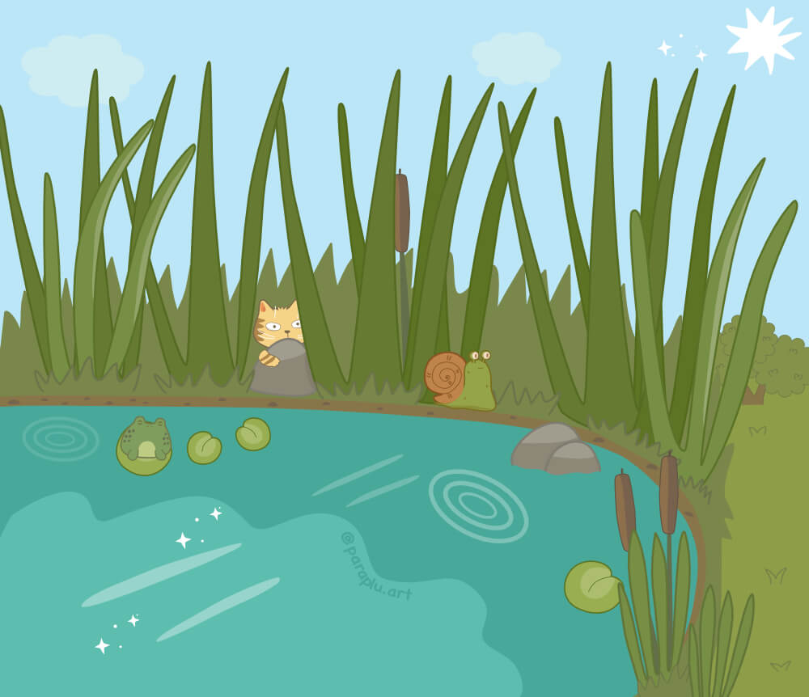
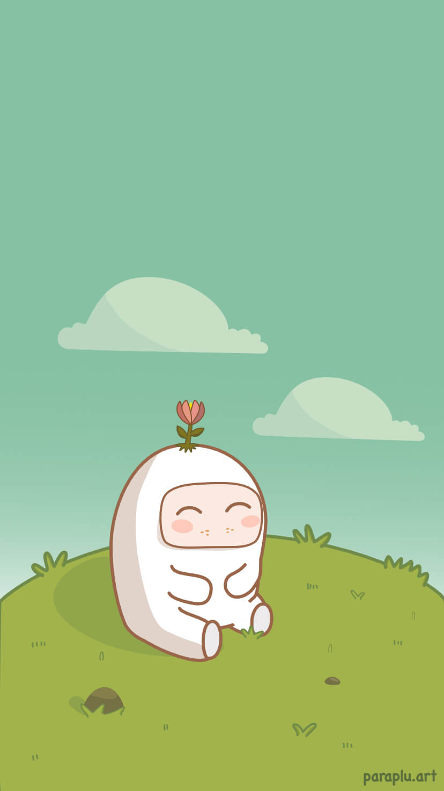

  

Since childhood it has been my passion to draw. I have used different media, but during the last couple of years, I have mostly created digital images from my imagination. Every day I try to improve my skills and draw new images inspired by dreams, different characters, other art, cats … life!

Now I am working on a website for my art with the domain <a href="https://paraplu.art/">paraplu.art</a>. Paraplu means ‘umbrella’ in Dutch. This word makes me smile. The website is a place for all my work and visitors are welcome to save pictures and print them. The site is being developed and, for the moment, you can easily see more of my images on Instagram – <a href="https://www.instagram.com/paraplu.art/">&commat;paraplu.art</a>

  

I do it just for fun. It is my hobby. It makes me happy. Please join part of my world and smile with me.
